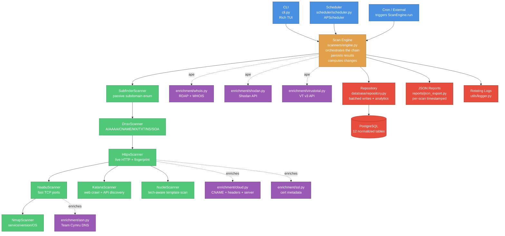
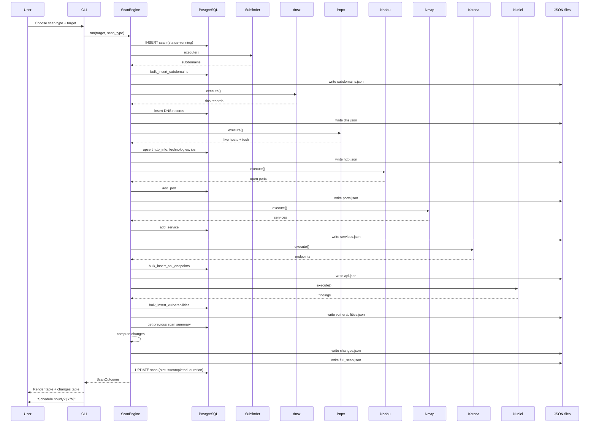
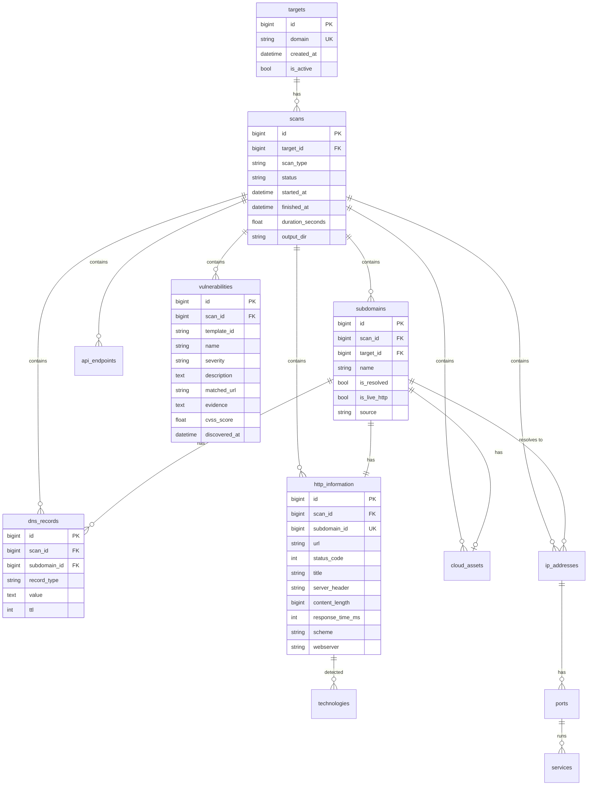
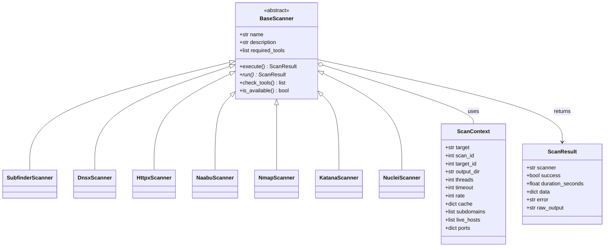

# XFinder – Architecture Diagram

The architecture is documented in two forms:

1. **Mermaid diagram** (renders on GitHub) — below.
2. **ASCII art diagram** — see [README.md → Architecture](../README.md#architecture).

## Mermaid Source

## Scan-Workflow Sequence Diagram

## Database ER Diagram

## Plugin Architecture

## See Also

- [README.md → Architecture](../README.md#architecture) — narrative description.
- [User Guide](USER_GUIDE.md) — how to operate XFinder.
- [Troubleshooting](TROUBLESHOOTING.md) — common issues and fixes.
